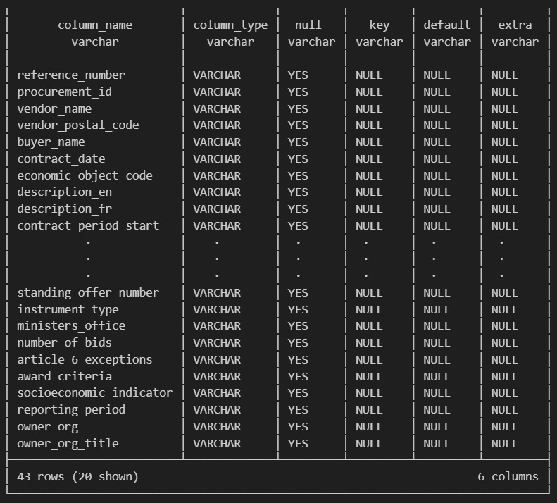
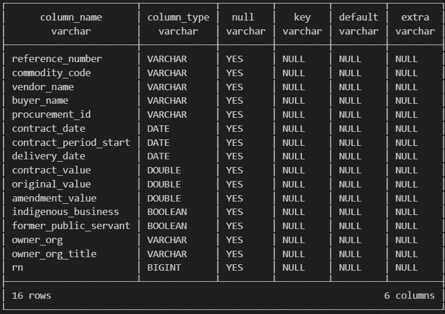

# Data Cleaning & Preparation
*The focus drives the preparation, not the other way around*

##### [Table of Contents](../README.md) | [Previous Page](01-exploration.md) | [Next Page](03-insights.md)

---

Preparing a dataset of this size requires careful validation before meaningful analysis can begin. While the dataset contains over **1.2 million records and 43 columns**, not every field requires transformation or correction. Instead, preparation is guided by the insights being explored.

The goal is not to perfectly normalize the entire dataset, but to ensure that the **fields used for analysis are reliable, consistent, and usable**

---

## Key Observations:
- Over **1.1 million** database entries.
- `reference_number` appears to be the unique contract identifier.
- Data types are inconsistent, every column stored as **varchar.**
- All columns nullable.  
  - Not necessarily problematic.  
  - Important to account for during analysis.

---

## The Key Question:
If `reference_number` is the unique contract identifier, why are there multiple entries per reference number.

Two simple queries provide clarity.

- **SELECT COUNT(*) FROM contracts**  
  **1,126,327** rows.

- **SELECT COUNT(DISTINCT reference_number) FROM contracts**  
  **499,862** rows.

---

## What This Reveals:

The dataset contains far more rows than unique contract identifiers. Average of **2.5 records** per contract.

Seems to be structured as:
**Procurement
   └── Contracts
           └── Amendments / updates**

This strongly suggests that contracts appear **multiple times across reporting periods or amendments.**

Rather than representing static records, the dataset reflects contracts **changing over time.**

Each row may represent:
- an amendment.
- an update to contract value.
- a new reporting entry for the same contract.

Understanding this structure is essential before performing any aggregation or financial analysis.

---

## Cleaning Strategy

In its raw state, the dataset is difficult to analyze.

Several preparation steps are required to make the data usable.

- Trim fields such as `vendor_name` and `buyer_name` to remove whitespace.
- Normalize `vendor_postal_code`.
- Cast date fields from **varchar to actual date types.**
- Cast financial fields (`contract_value`, `amendment_value`, `original_value`) to **double.**
  - Enables arithmetic.
  - Required for financial analysis.
- Convert encoded flags to boolean.  
  - `former_public_servant` **Y/N becomes True/False.**
- Partition by `reference_number` and order by `contract_date`.
  - Allows the analysis to work with the **latest state of each contract.**
  - Prevents duplicate counting during aggregation.

---

## Centralized Cleaning Logic

To keep the workflow consistent, the cleaning process is implemented through a reusable Python function.

This centralizes the preparation.

- Changes to cleaning logic occur in one location.
- Changes are reflected in all notebooks.
- Keeps the analysis code simple and focused.
- Encapsulated, leverages key advantages of OOP.
- DRY.

The cleaning function is located in.  
**[utils.py](../notebooks/utils.py)**

---

## Table Structure Before Cleaning:

---
## Table Structure After Cleaning:
