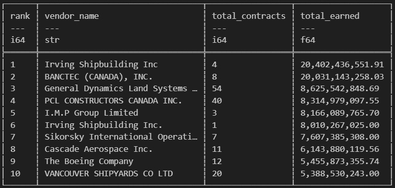
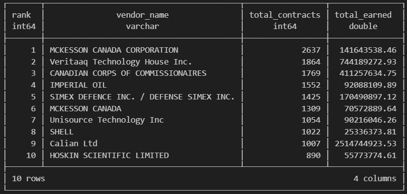
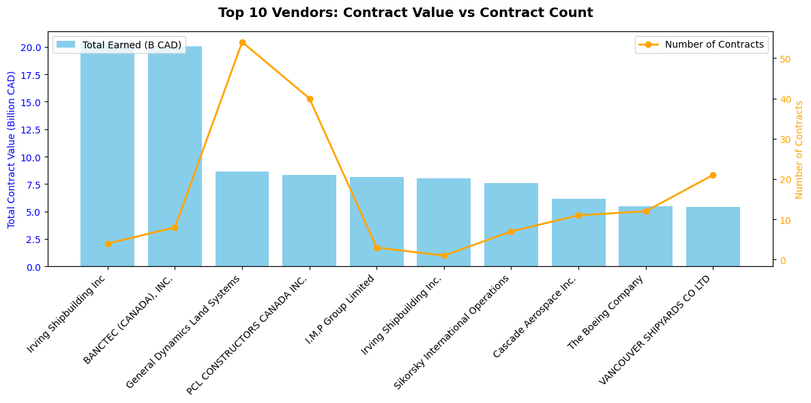
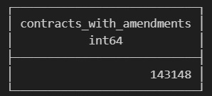
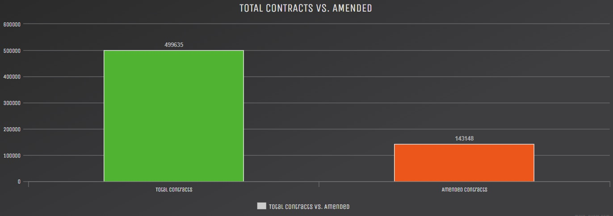
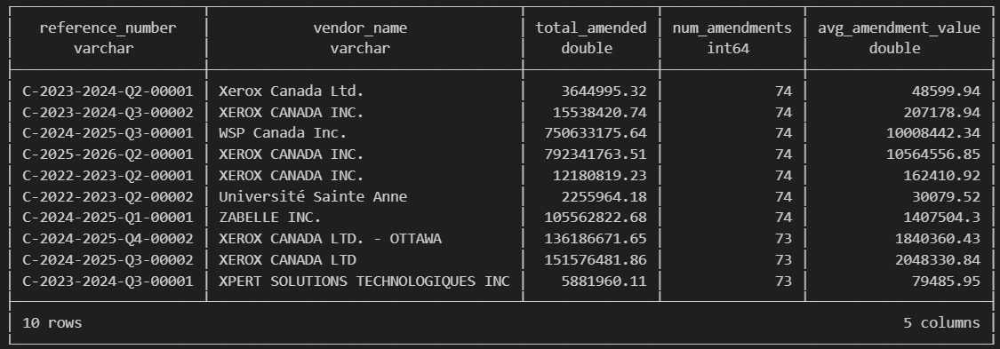
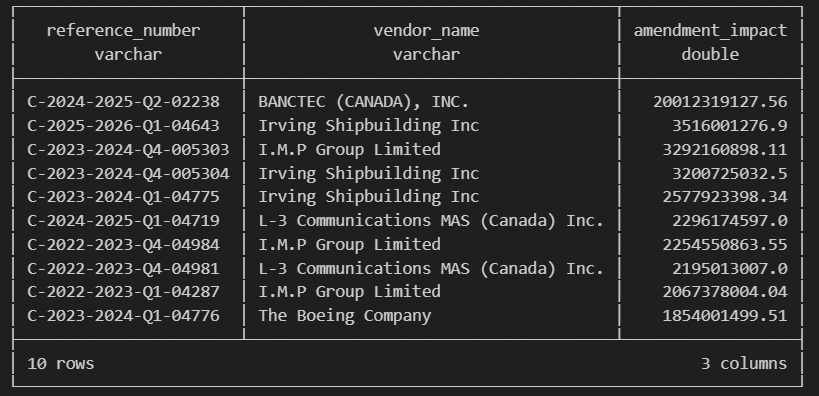
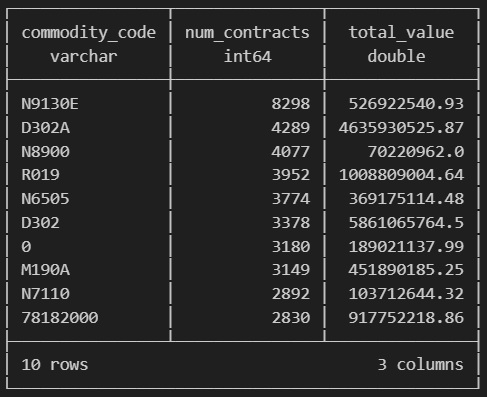
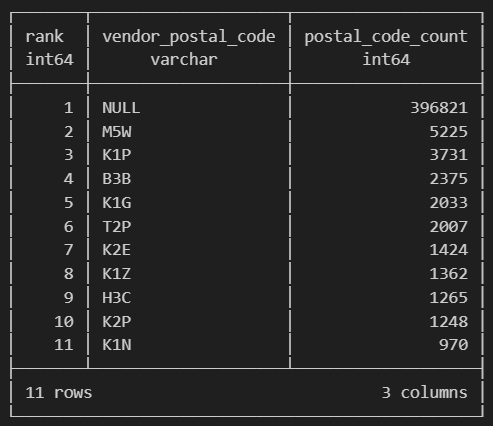
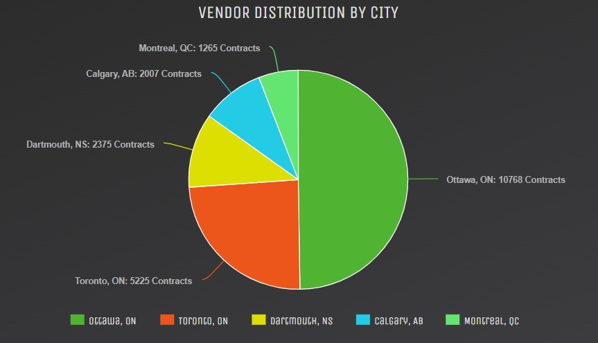

# Insights & Patterns
##### [Table of Contents](../README.md) | [Previous Page](02-cleaning.md) | [Next Page](04-quality-and-tradeoffs.md)
---

## My Focus:
The analysis highlights patterns in vendor activity, contract amendments, and key commodities or services. The insights emphasize magnitude, frequency, and impact.

---

## 1. Contract Count vs. Contract Value

**What it Means:**  
- There is **no correlation** between the number of contracts a vendor receives and the revenue they earn.  
- **Fewer contracts can yield more money** due to multi-year, multi-billion-dollar projects.  
- Vendors with high contract counts mostly handle smaller contracts.  
- Example: **Irving Shipbuilding Inc.** initially seemed to have erroneous earnings, but in reality:
  > "In March 2025, the Canadian government awarded Irving Shipbuilding Inc. an initial $8 billion (CAD) contract to build the first three River-class destroyers. This six-year, Halifax-based project is the largest in Canadian naval history" — Canada.ca  
- Contract counts alone are **misleading** when assessing vendor impact or government spending.  

**Interpretation:**  
Large contracts dominate revenue for some vendors, while others may have hundreds or thousands of smaller contracts. As a result, total contract value is a better indicator of vendor impact than contract count.

**Top 10 Vendors By Value:**  

 
**Top 10 Vendors By Value Contract Count:**  

 

---

## 2. The Financial Impact of Contract Amendments

**What it Means:**
- A significant portion of contracts experience changes after they are awarded.  
- Nearly **one third of all contracts have been amended**, indicating that contract adjustments are common in government procurement.  
- Some contracts show **extremely high amendment counts**, suggesting they are more operational or iterative in nature.  
- High amendment frequency may indicate:
  - Complex or evolving project requirements.
  - Changes to scope or delivery timelines.
  - Contracts designed with expected modifications over time.

**Vendor Context:**
- **Xerox Canada** appears frequently among highly amended contracts  
- Government procurement records often categorize these contracts as **office equipment, furniture, and related services.**
- These types of operational supply contracts may naturally involve frequent updates such as quantity adjustments, renewals, or equipment changes

**Interpretation:**
Contracts with many amendments are not necessarily problematic. In some cases they reflect long-running operational agreements where change is expected. However, highly volatile contracts may still require closer oversight to ensure scope changes and cost adjustments remain controlled.

**Visuals:**

*Nearly one third of all contracts have been amended.*

---
**Top 10 Contracts By Amendment Count:**

 
**Top 10 Contracts By Financial Impact:**

---
## 3. Contracts by Commodity Code

**What it Means:**
- Commodity codes classify the **type of goods or services** purchased by the government.
- Looking at contract frequency by commodity reveals **where procurement activity is concentrated.**
- Some commodity categories appear extremely frequently, suggesting **routine operational purchasing.**
- Other categories generate **large financial totals**, indicating high-value service contracts.

**Observation:**
- Several of the most common commodity codes relate to **IT services, equipment, and operational supplies.**
- Some codes generate relatively **low total value despite high contract counts**, indicating many small purchases.
- Others generate **very high total value with fewer contracts**, reinforcing the earlier insight that contract count does not always reflect financial impact.

---

**Top 10 Commodity Codes:**

**Top Five Goods/Services by Code:**
- **N9130E** - Fuel/Petroleum Products.
- **D302A** - IT Systems Development Services.
- **N8900** - Food & Related Products.
- **R019** - Professional/Admin Services.
- **N6505** - Drugs & Pharmaceutical Products.
- **0** - Likely a data artifact/error. 

**Interpretation:**
Commodity data highlights the types of services and goods most frequently purchased.  
Operational supplies and IT services appear heavily represented, indicating that ongoing government operations drive a large share of procurement activity.

However, similar to vendor analysis, **frequency does not necessarily equal financial impact**. Certain commodity categories generate significant spending even with fewer contracts.

---

## 4. Vendor Distribution by Postal Code

**What it Means:**
- Vendor postal codes help determine **where contracted work is concentrated geographically.**
- A large portion of records contain **missing postal codes**, which limits full geographic analysis.
  - **cleanContracts()** handles this through normalization.
- Among available data, there is a clear concentration of vendors in specific regions

**Observation:**
- The most frequent postal code entries are heavily concentrated in **Ottawa.**
- Postal codes including **K1P, K1G, K2E, K1Z, K2P, and K1N** all correspond to Ottawa
- These account for **10,768 vendor records** alone in my findings (top 10 postal codes). 
- Other notable clusters appear in:
  - **M5W** (Toronto)
  - **H3C** (Montreal)
  - **T2P** (Calgary)
  - **B3B** (Halifax)

- A significant limitation:
  - **NULL postal codes (~396,000 records)** represent the largest group, reducing completeness.

**Interpretation:**
Procurement activity appears highly concentrated in **Ottawa**, which aligns with it being the administrative center of the federal government. This suggests many contracts are awarded to vendors located near government offices or headquarters.

However, the large number of missing postal codes introduces uncertainty. While the visible trend is strong, the true geographic distribution may be broader than observed.

**Visuals:**

 
