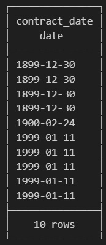
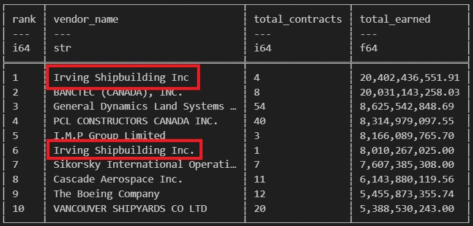

# Data Quality & Trade-offs
##### [Table of Contents](../README.md) | [Previous Page](03-insights.md) | [Next Page](05-next-steps.md)
---

## The Glaring Issues:

As discussed earlier, the dataset reflects contracts **changing over time** rather than static records.

This introduces several structural challenges:

- **Multiple rows per contract.**
- **Reference numbers are not unique identifiers.**
- Contract records must be organized before meaningful financial analysis can occur

Without addressing this structure, simple aggregations would produce misleading results.

---

## Calculation Complexity:

Each contract update includes three financial fields:

- `contract_value` - the **current total value** of the contract, including all amendments.  
- `original_value` - the **initial value** when the contract was first awarded.  
- `amendment_value` - the **change introduced by that specific update.**

On average, **2.5 rows exist per reference number**, meaning a single contract is represented multiple times as it evolves.

Because `contract_value` already represents the **to-date value of a contract**, summing this column across all rows would **inflate financial totals**.

---

## Amendment Values:

Amendments may be **positive or negative**, reflecting increases or decreases in contract cost.

This means contract values are not strictly cumulative across rows. Instead, each record represents the **state of the contract at a point in time**.

To accurately measure contract spending, we must isolate the **most recent version of each contract**.

---

## Resolving the Issue:

To preserve financial integrity, contracts were organized using a window function:

```sql
ROW_NUMBER() OVER (
    PARTITION BY reference_number
    ORDER BY TRY_CAST(contract_date AS DATE) DESC
) AS rn 
```

---

## Interesting Data Quality Issues:

While working through this report, multiple interesting data quality issues arose. While many of these did not directly impact my analysis, they were extremely intriguing and showed me the complexity of working with large datasets.

### Erroneous Contract Dates:


- Likely a data issue.
- Somebody meant to type 1999.
- Or are there really contracts as old as 1899?

### Subtle Differences:


- Tiny differences in naming throws queries off.
- Massively complicates querying and data cleaning/preparation.
- The implications of many people entering data into one database over many years.

**How I Would Solve This With More Time:**
- Send vendor names to lowercase.
- Remove grammar such as periods commas hyphens with a regex expression.
- Match against and remove common terms such as incorporated, ltd, limited, corp using a regex replace.
- Time consuming, but possible!

---

### Trade-offs:

In a dataset of this size, it is expected that **errors and inconsistencies accumulate over time** due to years of manual entry.

Resolving every inconsistency would require significant engineering effort and time.

Instead, the focus of this analysis was placed on **fields most relevant to the questions being explored**, ensuring the integrity of the insights while avoiding unnecessary preprocessing.

Attempting to correct every anomaly would not be an effective use of time for an exploratory analysis. A more practical approach is to identify the **critical variables required for analysis**, validate those carefully, and acknowledge remaining imperfections in the data.